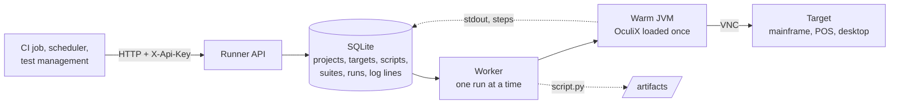

# OculiX Runner

**Run your OculiX tests in CI/CD.**

OculiX Runner brings your visual automation scripts into your CI pipeline. Deploy it with Docker,
submit scripts or suites over HTTP, stream the log into your job, and let the final status pass or
fail the pipeline.

Tests run headlessly, with OculiX kept warm between executions. Connect your VNC targets and run
your visual checks without opening the IDE. Nothing is installed on the targets.

https://github.com/user-attachments/assets/b6ed5c2d-1fe7-4bfb-a89f-f7a702ae92de

*A TSO logon on a TK5 mainframe, recorded by the runner itself: the run's log on the left, the
screen on the right, same clock.*

## 📚 Documentation

| Page | Read it for |
|---|---|
| [Get started](get-started.md) | deploy, first run, read a verdict |
| [Best practices](best-practices.md) | sizing, partitioning suites, security in restricted zones |
| [API reference](api-reference.md) | every route, its arguments, statuses, errors |
| [Docker image](docker-image.md) | contents, variables, volumes, the OculiX jar |
| [CI recipes](ci-recipes.md) | GitHub Actions, GitLab CI, Jenkins |

## 🎯 Use cases

| Scenario | What the runner does |
|---|---|
| Scheduled checks | a scheduler submits a suite every night |
| CI/CD | the pipeline submits, streams the log, fails on the status |
| Batch execution | ordered suites, stop or continue on failure |
| Several targets | mainframes, tills, desktops, each a row addressed by name |
| Containers | one container is one engine; several run in parallel |

## 🧭 How it works

| | What | Why it matters |
|---|---|---|
| Warm engine | OculiX and Jython initialized once at start | a script starts in under a second, not 15 |
| Queue | runs are rows with a status, one worker | survives a restart, nothing is lost |
| Traceability | script and hash, parameters, jar hash, timestamped log, steps, status | every run can be replayed and audited |
| No agent | scripts drive the target through VNC | works on mainframes, tills, air-gapped zones |
| Keys and audit | scoped API keys, journaled writes | who ran what, when |

## 🖥️ Demo target

A public image of TK5, MVS 3.8j under Hercules, with KICKS 1.5.0 installed and starting at logon:
`ghcr.io/julienmerconsulting/target-mainframe-kicks:1.5.0-installed`. VNC on 5900, noVNC on
6080, account HERC01 / CUL8TR. It is what the video shows.

## 📬 Availability

OculiX Runner is a licensed product of OculiX's author; its source is not published. These pages
say how it works and how to operate it. To deploy it, contact **julien.mer@oculix.org**.
