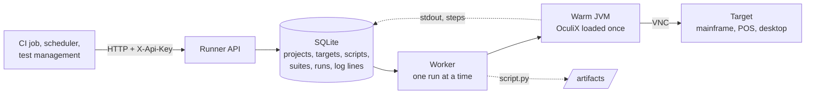

# OculiX Runner overview

OculiX Runner is the execution service that runs OculiX scripts **without the IDE**: a warm OculiX
JVM behind an HTTP API, with a SQLite base that records every run. It is what you deploy when
OculiX scripts have to run from a scheduler, a CI/CD pipeline or a container, against VNC targets
that nothing is installed on.

The runner is a **licensed product** of OculiX's author; its source is not published. This folder
documents how it works and how to operate it. To deploy it, contact
**julien.mer@oculix.org**.

A TSO logon on TK5 through the runner, recorded by the runner itself: the run's log on the left,
the mainframe screen on the right, same clock.

https://github.com/user-attachments/assets/b6ed5c2d-1fe7-4bfb-a89f-f7a702ae92de

## Use cases

| Scenario | What the runner does |
|---|---|
| **Scheduled checks** | A cron job or a scheduler submits a suite every night; the runner keeps the engine warm, so the hundredth script starts as fast as the first. |
| **CI/CD integration** | The pipeline submits scripts or suites over HTTP, streams the log into the job, reads the final status and passes or fails the build. |
| **Batch execution** | A suite is an ordered list of scripts with their own targets and parameters; it stops at the first failure or continues, per item. |
| **Distributed targets** | Targets are rows of the base: several mainframes, tills or desktops behind one runner, each addressed by name. |
| **Containers** | The runner ships as a Docker image; one container is one execution engine, several containers execute in parallel. |

## How it works

- **Warm engine.** OculiX and its Jython interpreter are initialized once, at service start. A script
  that took 15 s to start from the command line executes in under a second.
- **Queue.** Runs are rows in the base with a status; a single worker executes them in creation
  order. The queue survives a restart.
- **Traceability.** Each run keeps the exact script that executed, its SHA-256, the parameters, the
  OculiX version and jar hash, every log line with a millisecond timestamp, the steps the script
  declared, and its final status.
- **Nothing on the target.** Scripts drive the target through VNC, as they do from the IDE. The
  target needs a reachable VNC server, nothing else.
- **Keys and audit.** Every call carries an API key with a scope; every write is journaled with the
  key's name.

## Documentation

| Page | Content |
|---|---|
| [Get started](get-started.md) | Requirements, deployment, first run, reading a verdict |
| [Best practices for scalable and secure testing](best-practices.md) | Sizing, partitioning suites, parallel runners, security in restricted zones |
| [API reference](api-reference.md) | Every route, its arguments, statuses and error codes |
| [Docker image](docker-image.md) | What the image contains, how to run it, volumes, variables, the OculiX jar |
| [CI recipes](ci-recipes.md) | GitHub Actions, GitLab CI and Jenkins jobs that submit, wait and fail on the verdict |

## Demo target

A public image of TK5, MVS 3.8j under Hercules, with KICKS 1.5.0 installed, is available as a
demonstration target: `ghcr.io/julienmerconsulting/target-mainframe-kicks:1.5.0-installed`. It
exposes VNC on port 5900 and noVNC on 6080; the TSO account is HERC01 / CUL8TR and KICKS starts at
logon. It is what the video above shows.
