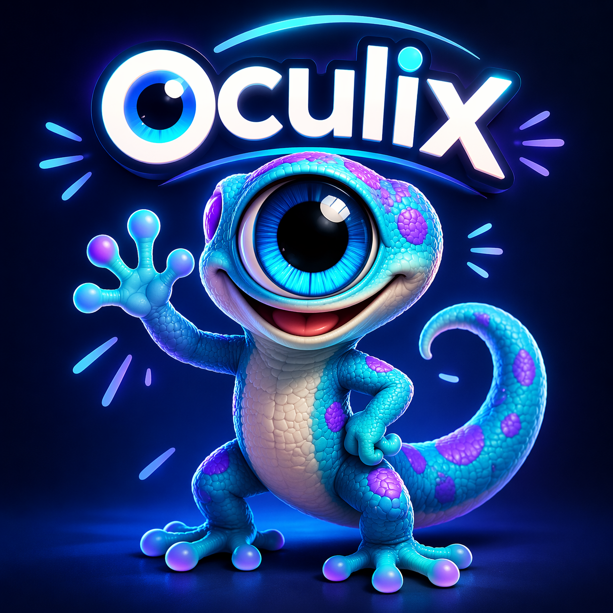
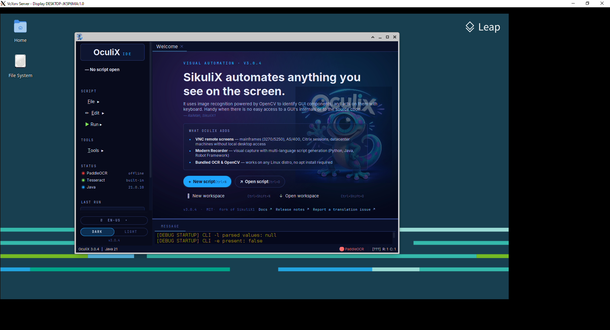

<div align="center">



# OculiX

**If you can see it, you can automate it.**

Turn the tasks you repeat on screen into scripts you can run again.
Capture what to click, record a workflow, and check the result.

**Windows · macOS · Linux · VNC · Android**

[](https://adoptium.net)
[](LICENSE)
[](https://github.com/oculix-org/Oculix/releases)
[](https://central.sonatype.com/namespace/io.github.oculix-org)
[](https://www.bestpractices.dev/projects/12878)
[](https://oculix.org)

[**Download the IDE**](https://github.com/oculix-org/Oculix/releases) · [**Get started**](#try-it-on-your-own-screen) · [**Documentation**](https://oculix.org) · [**First script**](https://oculix.org/getting-started/first-script/)

</div>

---

Exporting the same report. Filling the same form. Checking that a desktop workflow still works after an update. OculiX lets you turn those on-screen actions into a script you can inspect, change and replay.

**OculiX finds what you see and acts on it:** locate a button by its image, read text with OCR, click, type, and wait for the expected screen. Its visual targets do not require access to the application's DOM, source code or accessibility tree.

Start in the visual IDE, where captured images appear directly in your code. Use the recorder to build a first workflow, then add the checks that matter to you. The IDE and API are **open source under the MIT license**, and scripts can also run from the command line or your own application.

## What will you automate?

| Your task | How OculiX helps |
|---|---|
| **Repeat a desktop workflow** | Fill forms, navigate menus and export reports by recognising the controls on screen. |
| **Test what a user actually sees** | Perform a journey, wait for expected images or text, and check the visible result. |
| **Work across applications** | Follow a workflow through several windows, including remote desktop clients and interfaces rendered with Canvas or WebGL. |
| **Reach a remote system** | Connect through VNC to a desktop, a point-of-sale environment or a terminal emulator displaying a mainframe session. |
| **Automate Android** | Find and interact with screen content over USB or Wi-Fi through ADB. |

## Try it on your own screen

**You need Java 17 or later, 64-bit**, for example [Eclipse Temurin](https://adoptium.net).

1. **Download the IDE JAR for your platform** from [Releases](https://github.com/oculix-org/Oculix/releases): `oculixide-4.0.0-windows.jar`, `oculixide-4.0.0-macos.jar` or `oculixide-4.0.0-linux.jar`. OpenCV and Tesseract are included.
2. **Open the IDE.** Double-click the JAR, or launch it with Java. On Windows:

   ```bash
   java -jar oculixide-4.0.0-windows.jar
   ```

3. **Create a script and capture a target.** The editor displays captured images directly inside your code. You see the button you are looking for, rather than just its filename.
4. **Run a small action and check the result.** Start with a button in a test application, then add the next step.

<div align="center">

</div>

**Prefer to start by doing?** Use the **Modern Recorder** to capture interactions and generate code, then review the targets, add checks and replay the workflow. Code generation is available for Jython, Java and Robot Framework.

[Installation and platform setup](https://oculix.org/getting-started/installation/) · [First-script tutorial](https://oculix.org/getting-started/first-script/) · [IDE details](IDE/README.md)

### A script you can read

This Jython example starts with the application already open. Capture the named images from your application and save them with the script.

```python
from sikuli import *

click("file_menu.png")
click("export_to_csv.png")
wait("save_dialog.png", 10)
click("filename_field.png")
type("report_today.csv")
click("save_button.png")

# Check the result, not just the clicks.
assert exists("export_complete.png", 10), "Export confirmation not found"
```

The PNG files are the visual targets. In the IDE, they appear as thumbnails inside the script. You control the sequence, the waits and what counts as success.

## Built for the screens you work with

**Find images and read text.** Use visual matching to locate controls and OCR to read labels or values. Tesseract is bundled with language models; PaddleOCR is an optional HTTP service for additional multilingual and CJK workloads. Search regions, similarity thresholds and timeouts let you tune each interaction.

**Use the same visual API locally, remotely and on Android.** `Screen`, `VNCScreen` and `ADBScreen` provide the familiar find, click, type and wait operations for their respective targets. VNC supports parallel sessions and SSH tunnelling. A remote target needs an accessible VNC server, but no OculiX installation. Android requires an authorised ADB connection.

**Keep script execution local.** Image matching, bundled OCR and scripted actions can run without a cloud service or an LLM. Optional MCP integration lets an AI client call OculiX tools when you choose that workflow.

**Keep the evidence.** The optional [Reporter](Reporter/README.md) produces a self-contained HTML report with embedded screenshots, matches and timings. It also provides failure diagnosis and history-based flaky-test detection, with integrations for JUnit 5, TestNG and Selenium.

**Work in an IDE you can make your own.** Choose a light or dark theme, use the translated interface and customise capture and stop shortcuts.

**Build on existing SikuliX work.** The IDE bundles Jython and JRuby, supports additional script runners, and retains the `org.sikuli.*` namespace. Existing SikuliX projects have a migration path; developers can use the Java API directly.

Visual automation works from the rendered screen. Changes to an application's appearance, scaling or layout can require updated images or matching settings. Capture representative targets and validate scripts in the environments where they will run.

## See it reach beyond the desktop

The same visual approach also works on remote screens. Here is a TSO logon on a TK5 mainframe environment, driven through VNC. The recording shows the execution log and the target screen side by side, on the same clock.

https://github.com/user-attachments/assets/b6ed5c2d-1fe7-4bfb-a89f-f7a702ae92de

*This demonstration uses OculiX Runner, the separately licensed execution service described below. VNC support itself is included in the open-source API and IDE.*

## Need an execution service?

**Direct execution is part of open-source OculiX.** You can run scripts without opening the IDE and invoke them from your own scheduler or CI job. See the [CLI documentation](https://oculix.org/reference/cli/).

**OculiX Runner** adds a service for teams that need to submit, queue and track executions over HTTP:

- **A warm engine:** OculiX and Jython initialise once when the service starts, avoiding a new engine startup for every script.
- **Persistent execution records:** queued runs, named targets, parameterised scripts and ordered suites, with per-item failure handling.
- **CI/CD integration:** submit a run, stream its log, read the final status and use it to pass or fail a pipeline.
- **Traceability:** retain the exact executed script and its SHA-256, parameters, OculiX version and JAR hash, timestamped logs, declared steps and final status.
- **Container deployment:** one execution engine per container, processing one run at a time; deploy multiple runners for parallel execution.
- **Scoped API keys:** authenticate calls and attribute writes to a named key.

**The Runner is a separate product. Its source is published under the PolyForm Strict license, which forbids commercial use and modification; the MIT license of the IDE and API does not cover it.**

[**Runner overview**](CI/README.md) · [Deployment](CI/get-started.md) · [CI recipes](CI/ci-recipes.md) · [API reference](CI/api-reference.md)

For deployment and licensing: **[julien.mer@oculix.org](mailto:julien.mer@oculix.org)**.

## Choose your entry point

| You want to… | Start here |
|---|---|
| Capture, record, edit and run visual scripts | [OculiX IDE](IDE/README.md) |
| Add visual automation to a JVM application | [OculiX API](API/README.md) |
| Publish execution reports with screenshots | [OculiX Reporter](Reporter/README.md) |
| Give an MCP-compatible agent visual-control tools | [OculiX MCP Server](MCP/README.md) |
| Operate a queued HTTP execution service | [OculiX Runner — PolyForm Strict license](CI/README.md) |

The MCP server records tool calls in an Ed25519-signed, SHA-256-chained audit journal, with a verification command. See its [documentation](MCP/README.md) for configuration, isolation guidance and the scope of verification.

<details>
<summary><strong>For developers: Maven dependency and source build</strong></summary>

### Java API

```xml
<dependency>
    <groupId>io.github.oculix-org</groupId>
    <artifactId>oculixapi</artifactId>
    <version>4.0.0</version>
</dependency>
```

```java
import org.sikuli.script.Screen;

Screen screen = new Screen();
screen.click("export_button.png");
screen.wait("export_complete.png", 10);
```

See the [API README](API/README.md) for native dependencies, remote screens and Android support.

### Build from source

```bash
git clone https://github.com/oculix-org/Oculix.git
cd Oculix
mvn clean install -DskipTests
```

For a complete, platform-specific IDE JAR, use the packaging instructions in the [IDE README](IDE/README.md).

Native libraries are supplied by [Apertix](https://github.com/oculix-org/Apertix) for OpenCV and [Legerix](https://github.com/oculix-org/Legerix) for Tesseract, Leptonica and bundled OCR models.

</details>

## Built on the field

**Field needs drive OculiX forward. Yours can shape its next release.**

Banking, industry, cybersecurity, healthcare, transport, research: the environments change, the need stays concrete: automate the work done on screen, including in software that was never designed for it. A business application without an API, a workflow across several windows, a legacy system still in daily use: these are the realities OculiX is built on.

**Conversations with users turn into improvements the whole community can use.** Several changes in the latest releases started from a blocker met in production, a specific scenario or a requested feature. That feedback steers the fixes, extends what the engine can do and keeps the project honest against real-world demands.

A workflow to automate, a limit to push, an integration to share? **[Open a discussion](https://github.com/oculix-org/Oculix/discussions). Your use case can become the next step forward for OculiX.**

### Community projects

| Project | What it adds |
|---|---|
| [**oculix-vscode**](https://github.com/MiguelDomingues/oculix-vscode) by [@MiguelDomingues](https://github.com/MiguelDomingues) | Region capture, inline image previews, target offsets, interactive template-matching tests and script execution from VS Code, using the OculiX runtime JAR. |

## Help and contribute

- **Documentation:** [Installation](https://oculix.org/getting-started/installation/) · [First script](https://oculix.org/getting-started/first-script/) · [OCR](https://oculix.org/guides/ocr/).
- **Questions and bugs:** [Discussions](https://github.com/oculix-org/Oculix/discussions) · [Issues](https://github.com/oculix-org/Oculix/issues).
- **Contributions:** fixes, examples, translations and documentation are welcome. Read [CONTRIBUTING.md](CONTRIBUTING.md); discuss substantial changes in an issue first.
- **Security:** use a [private advisory](https://github.com/oculix-org/Oculix/security/advisories/new), following [SECURITY.md](SECURITY.md).
- **Professional support:** [Training, integration and enterprise support](https://oculix.org/support/enterprise/).

## License and lineage

OculiX continues the visual-automation lineage of **Sikuli (2009)** and **SikuliX**, maintained by **Raimund Hocke**. The `org.sikuli.*` namespace preserves that connection and compatibility with existing code.

The open-source project is released under the [MIT License](LICENSE). **OculiX Runner is separately licensed**, as described in [CI/README.md](CI/README.md).

🦎
