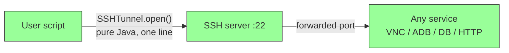
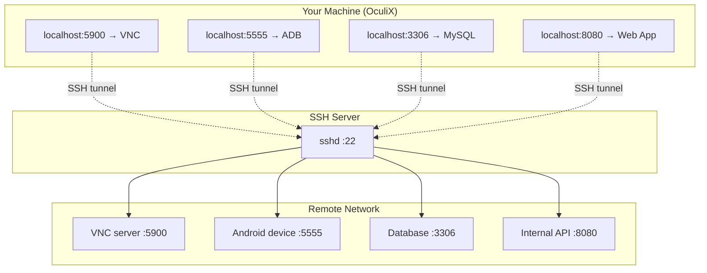

# SSH Tunnel


> Embedded SSH tunneling for **any** remote service — VNC, ADB, databases, HTTP APIs. Zero external dependencies, zero WSL/sshpass hacks. JSch is vendored in the JAR.

---

## Why This Matters

Before OculiX, automating a remote machine via VNC required:


**Problems:** OS-dependent tools, manual setup, no programmatic control, breaks in CI/CD.

With OculiX:



---

## It's Not Just For VNC

`SSHTunnel` is a **generic port forwarder**. Any TCP service reachable from the SSH server can be tunneled:



---

## API

### Quick Start — VNC tunnel in 3 lines

```java
try (SSHTunnel tunnel = SSHTunnel.open("192.168.1.100", "user", "password")) {
    VNCScreen vnc = VNCScreen.start("127.0.0.1", tunnel.getLocalPort(), 10, 1000);
    vnc.find("button.png").click();
    vnc.stop();
}
// tunnel auto-closes (implements Closeable)
```

### Full Control — any port, any service

```java
// Forward remote MySQL (port 3306) through SSH
SSHTunnel tunnel = SSHTunnel.open(
    "bastion.company.com",  // SSH host
    22,                      // SSH port
    "admin",                 // SSH user
    "s3cret",               // SSH password
    "db-server.internal",    // Remote host (from SSH server's perspective)
    3306,                    // Remote port
    0                        // Local port (0 = auto-assign)
);
int localPort = tunnel.getLocalPort();
// Connect to localhost:localPort → reaches db-server.internal:3306
```

### Auto-assign local port

```java
SSHTunnel tunnel = SSHTunnel.openAutoPort(
    "server.com", 22, "user", "pass",
    "target.internal", 5900
);
// tunnel.getLocalPort() → dynamically assigned port
```

---

## Method Reference

| Method | Parameters | Description |
|--------|-----------|-------------|
| `open(host, user, pass)` | SSH host, user, password | Quick connect — defaults to port 22, forwards VNC 5900→5900 |
| `open(host, port, user, pass)` | + SSH port | Custom SSH port, still defaults VNC 5900→5900 |
| `open(host, port, user, pass, remoteHost, remotePort, localPort)` | Full control | Forward any port. `localPort=0` for auto-assign |
| `openAutoPort(host, port, user, pass, remoteHost, remotePort)` | No local port | Always auto-assigns local port |
| `getLocalPort()` | — | Returns the local port (useful with auto-assign) |
| `isConnected()` | — | Check tunnel health |
| `close()` | — | Clean shutdown (removes forwarding, disconnects) |

---

## Security Configuration

Configured for maximum compatibility, including legacy servers (tested on SUSE 12):

```mermaid
graph TD
    subgraph "Cipher Negotiation"
        A["aes128-ctr ← preferred"] --> B["aes128-cbc"]
        B --> C["aes192-ctr"]
        C --> D["aes256-ctr"]
        D --> E["3des-cbc ← legacy fallback"]
    end
    subgraph "Key Exchange"
        F["ecdh-sha2-nistp256 ← preferred"] --> G["diffie-hellman-group-exchange-sha256"]
        G --> H["diffie-hellman-group14-sha1"]
        H --> I["diffie-hellman-group1-sha1 ← legacy"]
    end
    subgraph "Host Key Types"
        J["ssh-ed25519"] --> K["ecdsa-sha2-nistp256"]
        K --> L["ssh-rsa"] --> M["ssh-dss ← legacy"]
    end
```



| Setting | Value | Purpose |
|---------|-------|---------|
| MAC algorithms | `hmac-sha2-256`, `hmac-sha1` | Integrity verification |
| StrictHostKeyChecking | `no` | Dynamic/ephemeral server environments |
| ServerAliveInterval | 30s | Keepalive (firewall-friendly, not TCP) |
| ServerAliveCountMax | 3 | Disconnect after 3 missed keepalives (90s) |
| ConnectTimeout | 10s | Initial connection timeout |

---

## Architecture

```
com.sikulix.util.SSHTunnel
  ├── open()             → Factory methods (4 overloads)
  ├── openAutoPort()     → Auto-assign local port
  ├── getLocalPort()     → Returns assigned port
  ├── isConnected()      → Health check
  └── close()            → Cleanup (Closeable/try-with-resources)
        └── com.jcraft.jsch.* (100+ vendored files)
              ├── Session         → SSH connection
              ├── Channel         → Port forwarding channels
              ├── KeyExchange     → Diffie-Hellman / ECDH
              └── Cipher          → AES / 3DES encryption
```

---

## Real-World Scenarios

### 1. Automate a remote desktop via VNC over SSH

```
┌──────────────┐       SSH :22        ┌──────────────┐
│  CI/CD Runner │ ═══════════════════> │  Linux Server │
│  (headless)   │   tunnel 5900→5900  │  (VNC + app)  │
└──────────────┘                      └──────────────┘
```

```java
try (SSHTunnel tunnel = SSHTunnel.open("prod-server", "ci-user", "key123")) {
    VNCScreen screen = VNCScreen.start("127.0.0.1", 5900, "vncpass", 5, 1000);
    screen.find("login_button.png").click();
    screen.type("username\n");
    screen.stop();
}
```

### 2. Test an Android device behind a firewall

```
┌──────────────┐       SSH :22        ┌──────────────┐   USB/WiFi   ┌─────────┐
│  Dev Machine  │ ═══════════════════> │  Lab Server   │ ──────────> │ Android │
│               │   tunnel 5555→5555  │  (adb bridge)  │             │ device  │
└──────────────┘                      └──────────────┘             └─────────┘
```

### 3. Access an internal web app for visual testing

```java
SSHTunnel tunnel = SSHTunnel.open("bastion", 22, "user", "pass",
    "intranet.corp", 443, 8443);
// Now https://localhost:8443 reaches intranet.corp:443
```
