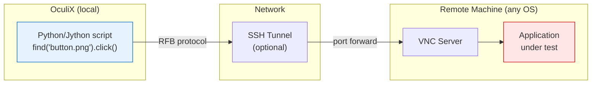
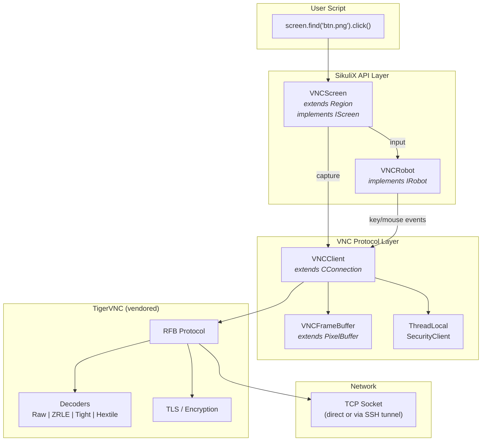
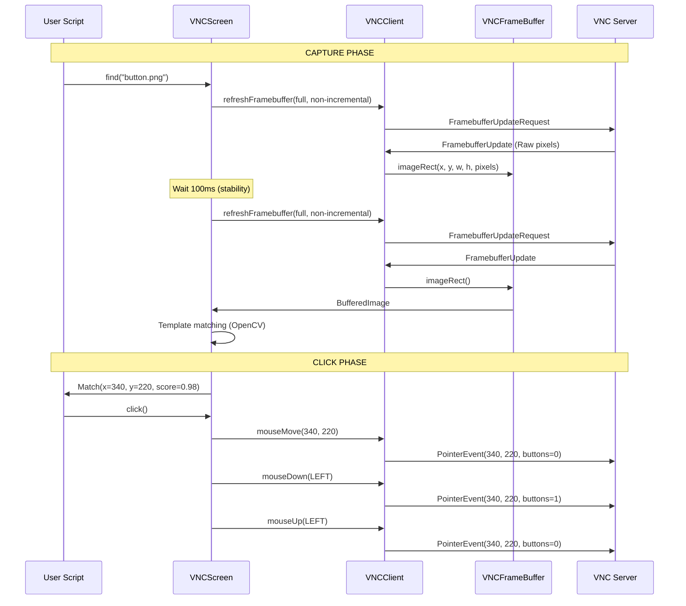
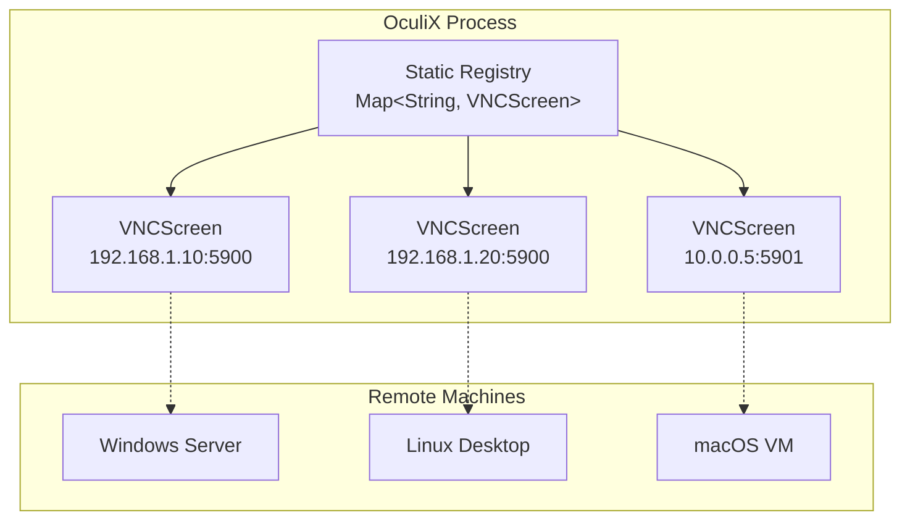

# VNC Full Stack


> VNC support existed in SikuliX1 but was incomplete and unstable. OculiX upgraded it to **production-grade** with vendored TigerVNC, corruption fixes, full input handling, and seamless integration with the find/click API.

---

## The Big Picture

OculiX turns **any machine with a VNC server** into an automatable screen — same `find()`, `click()`, `type()` API as local automation:



This works on **any machine**: Windows, Linux, macOS, headless servers, VMs, thin clients — anything running a VNC server.

---

## What SikuliX1 Had vs What OculiX Delivers

| Capability | SikuliX1 | OculiX |
|-----------|----------|--------|
| VNC connection | Basic, external TigerVNC dep | Vendored TigerVNC (100+ files in JAR) |
| Image stability | Frequent corruption | Double-refresh + stability wait |
| Encodings | Tight/ZRLE (buggy) | Raw (stable), all decoders available |
| Input | Partial keyboard | Full keyboard (2200+ keysyms) + mouse + wheel |
| Multi-screen | Single connection | Registry-based, multiple concurrent VNC screens |
| SSH integration | None | Built-in `SSHTunnel` (see [[SSH Tunnel]]) |
| Thread safety | Not guaranteed | `imageLock` on framebuffer, `ThreadLocalSecurityClient` |
| Headless/CI | Unreliable | Stable, tested in `-r` mode |

---

## Architecture



---

## Data Flow: How `find().click()` Works on a Remote Screen



> **Why double refresh?** The first request may return stale data from encoding lag. The 100ms wait + second refresh ensures the framebuffer reflects the actual screen state.

---

## Corruption Fixes (the hard wins)

VNC image corruption was the #1 reliability issue. Here's what was fixed:

| Commit | Problem | Fix |
|--------|---------|-----|
| `a22913e` | ZRLE/Tight decoders produced garbled pixels | Fixed `SetPixelFormat` negotiation — server and client pixel formats now match |
| `99e1c8a` | CPIXEL optimization in ZRLE/Tight caused byte misalignment | Disabled CPIXEL — minor bandwidth cost, major reliability gain |
| `fa6860c` | VeNCrypt/TLS handshake failed on some servers | Disabled VeNCrypt, use VncAuth only — TLS handled by SSH tunnel instead |
| `b1b2e2f` | Captures returned stale/partial screen | Double framebuffer refresh with sleep between requests |

### Current default: Raw encoding

```java
// VNCClient.java line 61
currentEncoding = Encodings.encodingRaw;
// "CDC fix: force Raw encoding to avoid corruption with TigerVNC/RFB 3.x"
```

Raw encoding = uncompressed pixels. More bandwidth, but **zero corruption risk**. On a LAN or SSH tunnel, the overhead is negligible.

---

## Keyboard: Full International Support

`VNCRobot` translates Java `KeyEvent` codes to **XLib/XWindow Keysyms** (2200+ codes in `XKeySym.java`):

```mermaid
graph LR
    A["Java KeyEvent<br/>VK_A, VK_F1, etc."] -->|keyToXlib()| B["XLib Keysym<br/>0x61, 0xFFBE, etc."]
    C["Java char<br/>'a', '!', '@', etc."] -->|charToXlib()| B
    B -->|VNCClient.keyDown()| D["RFB KeyEvent<br/>to VNC server"]
```

### Supported input

| Category | Examples |
|----------|---------|
| Letters | A-Z (with shift detection) |
| Numbers | 0-9, Numpad 0-9 |
| Function keys | F1-F24 |
| Modifiers | Ctrl, Shift, Alt, AltGr, Meta (Cmd/Win) |
| Special | Enter, Tab, Backspace, Escape, Delete, Insert |
| Navigation | Arrows, Home, End, PageUp, PageDown |
| Dead keys | Grave, Acute, Circumflex, Tilde, Diaeresis |
| Symbols | All US keyboard special chars with shift handling |

### Mouse support

| Action | Method |
|--------|--------|
| Move | `mouseMove(x, y)` |
| Click | `mouseDown(buttons)` / `mouseUp(buttons)` |
| Scroll | `mouseWheel(amount)` — up/down |
| Smooth move | `smoothMove(src, dest, duration)` — linear interpolation |
| Color pick | `getColorAt(x, y)` — 1x1 pixel capture |

Supports **8 mouse buttons** and multi-button combinations.

---

## Multi-Screen Registry



- Screens are keyed by `"ip:port"` in a static map
- `VNCScreen.start()` returns existing screen if already connected (no duplicates)
- `VNCScreen.stopAll()` cleans up everything on shutdown
- Each screen runs its own message processing thread

---

## Screen Stability Detection

Before capturing for template matching, OculiX can wait for the remote screen to stabilize:

```java
screen.waitForScreenStable(5000, 500);
// Polls every 50ms, compares frames
// Returns true when screen unchanged for 500ms (within 5s timeout)
```

This prevents false matches during screen transitions (loading spinners, animations, window redraws).

---

## Usage Examples

### Basic — automate a remote Linux desktop

```python
from sikuli import *

vnc = VNCScreen.start("192.168.1.100", 5900, "vncpassword", 5, 1000)
vnc.find("terminal_icon.png").doubleClick()
vnc.type("ls -la\n")
vnc.stop()
```

### With SSH tunnel — through a firewall

```python
from com.sikulix.util import SSHTunnel

tunnel = SSHTunnel.open("bastion.company.com", "admin", "sshpass")
vnc = VNCScreen.start("127.0.0.1", tunnel.getLocalPort(), "vncpass", 5, 1000)

vnc.find("app_icon.png").click()
vnc.waitForScreenStable()
vnc.find("submit_button.png").click()

vnc.stop()
tunnel.close()
```

### Multi-screen — automate several machines in parallel

```python
screen1 = VNCScreen.start("192.168.1.10")
screen2 = VNCScreen.start("192.168.1.20")

# Both screens are independent, concurrent
screen1.find("button.png").click()
screen2.find("button.png").click()

VNCScreen.stopAll()
```

---

## Key Classes

| Class | Package | Lines | Purpose |
|-------|---------|-------|---------|
| `VNCScreen` | `org.sikuli.vnc` | — | Screen abstraction, SikuliX API integration |
| `VNCRobot` | `org.sikuli.vnc` | — | Keyboard/mouse input via RFB |
| `XKeySym` | `org.sikuli.vnc` | 175KB | 2200+ international key definitions |
| `VNCClient` | `com.sikulix.vnc` | 776 | RFB protocol, connection lifecycle |
| `VNCFrameBuffer` | `com.sikulix.vnc` | — | Thread-safe pixel buffer |
| `VNCClipboard` | `com.sikulix.vnc` | — | Clipboard synchronization |
| `ThreadLocalSecurityClient` | `com.sikulix.vnc` | — | Thread-safe auth for parallel sessions |
| `BasicUserPasswdGetter` | `com.sikulix.vnc` | — | VNC password provider |
| `com.tigervnc.*` | vendored | 100+ files | Full RFB stack, decoders, TLS |
